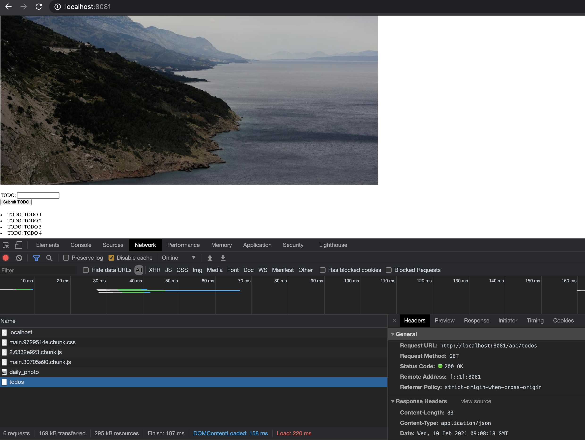
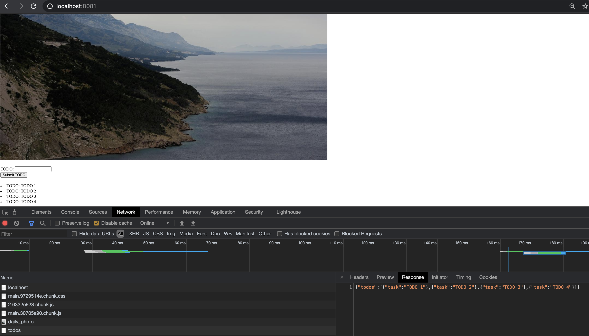
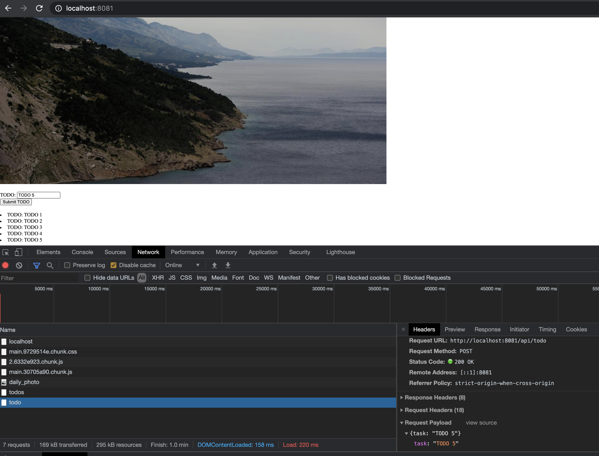
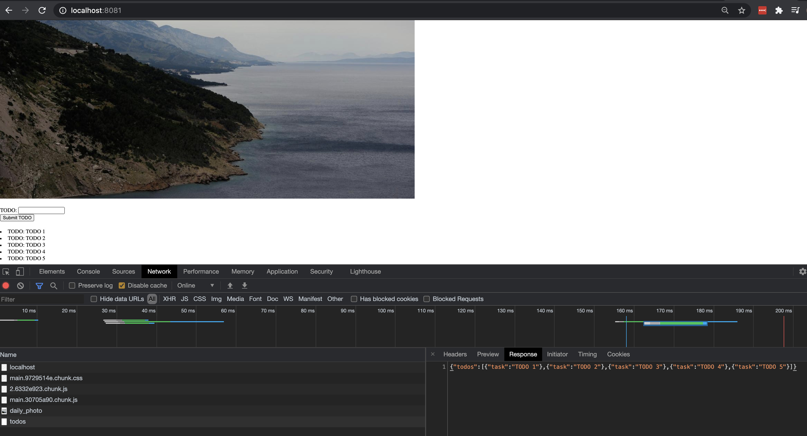

# Ex 2.02

## Building project application

To rebuild the same image, first checkout the correct tag:

```
git checkout ex2.02
```

In folder project/backend/

```
./docker_build_and_publish.sh ex2.02
```

In folder project/frontend/

```
./docker_build_and_publish.sh ex2.02
```

## Create cluster

```
k3d cluster create --port 8082:30080@agent:0 -p 8081:80@loadbalancer --agents 2
```

## Init filesystem

```bash
docker exec k3d-k3s-default-agent-0 mkdir -p /tmp/kube
```

## Global services:

In root folder:

```bash
§ k3d cluster start

$ kubectl apply -f manifests_global/

persistentvolume/hy-kube-pv created
```

## Deployment

### frontend

In folder project/frontend:

```
$ kubectl apply -f manifests/

deployment.apps/hy-kube-frontend-dep created
ingress.extensions/hy-kube-frontend-ingress created
service/hy-kube-frontend-svc created
```

### backend

In folder project/backend/:

```
$ kubectl apply -f manifests/

deployment.apps/hy-kube-backend-dep created
ingress.extensions/hy-kube-backend-ingress created
persistentvolumeclaim/hy-kube-project-claim created
service/hy-kube-backend-svc created
```


## Testing

Initial todos get:



Initial todos get response:



New todo post:



Todos get after new task:

