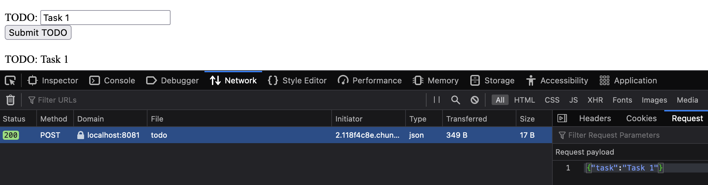

# Ex 2.07

## Checking out the correct version

To rebuild the same image, first checkout the correct tag:

```
git checkout ex2.08
```

## Building the applications


In folder project/backend/

```
./docker_build_and_publish.sh ex2.08
```

In folder project/frontend/

```
./docker_build_and_publish.sh ex2.08
```

## Create cluster

```
k3d cluster create --port 8082:30080@agent:0 -p 8081:80@loadbalancer --agents 2
```

## Init filesystem

```bash
docker exec k3d-k3s-default-agent-0 mkdir -p /tmp/kube
```

## Global services:

In root folder:

```bash
§ k3d cluster start

$ kubectl apply -f manifests_global/persistentvolume.yaml

persistentvolume/hy-kube-pv created
```

## Creating the namespace

```
kubectl apply -f manifests_global/hy-kube-project-namespace.yaml

namespace/hy-kube-project created
```

## Deployment

## Init & deploy secrets

in backend/manifests/secrets


Init secret when setting up for the first time:

Create template for Secret (without saving it to version control):

```yml
# project/backend/manifests/secrets/postgres-pwd.yaml
apiVersion: v1
kind: Secret
metadata:
  name: postgres-password
  namespace: hy-kube-project
data:
  PASSWORD: QW5vdGhlclZlcnlCaWdBbmRJbXBvcnRhbnRTZWNyZXQ= # FIXME, remember to encode to base64
```

```bash
age-keygen -o key.txt

sops --encrypt \
       --age age1k0upvtn0gwftpep5kxq47xztxj7ulmfhk6t9ha82sd6r5jrjsegsdr0wua \  # FIXME WITH YOUR PUBLIC KEY
       --encrypted-regex '^(data)$' \
       postgres-pwd.yaml > postgres-pwd.enc.yaml
```

Deploy:

```
$ SOPS_AGE_KEY_FILE=$(pwd)/key.txt sops --decrypt postgres-pwd.enc.yaml | kubectl apply -f -

secret/postgres-password created
```

### backend

in project/backend

```
$ kubectl apply -f manifests/

configmap/backend-config created
deployment.apps/backend-dep created
middleware.traefik.containo.us/strip-prefix created
ingress.networking.k8s.io/backend-ingress created
persistentvolumeclaim/project-claim created
configmap/project-db-config created
service/project-db-svc created
statefulset.apps/postgres-ss created
service/backend-svc created
```

### frontend

in project/frontend

```
$ kubectl apply -f manifests/

deployment.apps/frontend-dep created
ingress.networking.k8s.io/frontend-ingress created
service/frontend-svc created
```

## Testing

```
$ kubectl get pods --namespace hy-kube-project

NAME                            READY   STATUS    RESTARTS      AGE
postgres-ss-0                   1/1     Running   0             2m40s
backend-dep-6bd5b7d647-bzbv6    1/1     Running   1 (88s ago)   2m40s
frontend-dep-8544647698-s8mtn   1/1     Running   0             32s
```

Initial todo post:



Confirm with API call:

```
$ curl localhost:8081/api/todos
{"todos":[{"task":"Task 1"}]}%
```

Kill backend and stateful set:

```
$ kubectl delete pod backend-dep-6bd5b7d647-bzbv6 --namespace hy-kube-project
pod "backend-dep-6bd5b7d647-bzbv6" deleted

$ kubectl delete pod postgres-ss-0  --namespace hy-kube-project
pod "postgres-ss-0" deleted
```

See that the state still persist:

```
$ kubectl get pods --namespace hy-kube-project
NAME                            READY   STATUS    RESTARTS   AGE
frontend-dep-8544647698-s8mtn   1/1     Running   0          67s
backend-dep-6bd5b7d647-hw54w    1/1     Running   0          13s
postgres-ss-0                   1/1     Running   0          6s

$ curl localhost:8081/api/todos
{"todos":[{"task":"Task 1"}]}%
```