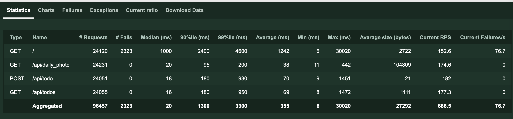

# Ex 3.08

## Checking out the correct version

To rebuild the same image, first checkout the correct tag:

```
git checkout ex3.08
```

## Building the applications

### Create cluster, other needed GCP resources and sync kubectl creds

```
make gcp-infra-preq gcp-infra-up gcp-sync-kubectl-creds
```

### Init secrets

Init (or update) the secret when setting up for the first time:

Create template for Secret (without saving it to version control) to
project/backend/manifests/secrets:

```yml
# project/backend/manifests/secrets/postgres-pwd.yaml
apiVersion: v1
kind: Secret
metadata:
  name: postgres-password
  namespace: hy-kube-project
data:
  PASSWORD: QW5vdGhlclZlcnlCaWdBbmRJbXBvcnRhbnRTZWNyZXQ= # FIXME, remember to encode to base64
```

Generate a new key:
```bash
age-keygen -o project/backend/manifests/secrets/key.txt
```

Update public key in .sops.yaml:
```yml
# project/backend/manifests/secrets/.sops.yaml
creation_rules:
  - encrypted_regex: "^(data)$"
    age: "age1k0upvtn0gwftpep5kxq47xztxj7ulmfhk6t9ha82sd6r5jrjsegsdr0wua" # FIXME
```

Encrypt the key:
```
make encrypt-project-secrets
```

Commit the updated versions of .sops.yaml and postgres-pwd.enc.yaml.

### Github Actions configuration

Github Action will build the project when pushed to 'master' or 'develop'.

The following Github secrets are needed:

* GCP_CREDENTIALS - GCP Credentials of the GCP GitHub service account
  * Can be shown in terminal with `make gcp-infra-preq gcp-infra-up gcp-show-github-sa-key`
* GKE_PROJECT - Name of the Google cloud project
* SOPS_PRIVATE_KEY - Private key used to encrypt the secrets, see the 'Init secrets'.
* DOCKER_PASSWORD - Dockerhub password, only needed for pingpong and mainapp
* DOCKER_USERNAME - Dockerhub username, only needed for pingpong and mainap

## Deployment

### Deploy manifests

Github action will automatically deploy project manifests to Kubernetes.

The namespace of the deployment will be:
hy-kube-project-{master,develop}

## Testing

### Initial limits

```
$ kubectl get ingress --namespace hy-kube-project-master
NAME              CLASS    HOSTS   ADDRESS          PORTS   AGE
backend-ingress   <none>   *       34.111.105.205   80      19m
```

Generating load for frontend:
```
$ for i in {1..1000}; do curl 34.117.104.209 ; sleep 0.1; done
````

frontend-dep resouce usage:


Settle for limits:

cpu: 10m
memory: 30MiB

Generating load for backend:
```
for i in {1..1000};
  do
    task=$(echo 'perf test number' $i)
    payload=$(jq -n --arg task $task '{task: $task}')
    curl -X POST 34.111.105.205/api/todo -H 'Content-Type: application/json' -d $payload
    echo ''
    curl 34.111.105.205/api/todos >> /dev/null
    echo ''
    sleep 0.1;
  done
```
backend-dep resouce usage:


Settle for limits:

cpu: 100m
memory: 50MiB

### Changes needed to support horizontal scaling

To support horizontal scaling for backend, I needed to rearchitect to structure it so that I only need to mount the disk for one of the deployments that handle the image persistent, and otherwise get the most recent image from that with API and cache it. This is because of the current volume claim ReadWriteOnce, that does not support claiming it between different nodes. And using GCP Filestore with ReadWriteMany is complext and very expensive (+200€ in a month), so this was better:
https://github.com/tkasu/hy-kube/commit/4e63bdb62b3d52e21e0e4c01c892bfde64f0564d

As that new imagesync service is called only every 5 minutes from each pod, it does not need to scale similarly than other services and it is the only one needing to claim a persistent disk.

### Load testing

1. `make loadtest-start-server`
2. open browser in localhost:8089
3. put the following values to locust dashboard:
  * 1000 concurrent users
  * 1/s spawn rate
  * ingress address


Quite a lot of failures. But we can see that the backend is scaling:


And GKE is scaling (numbers are: current nodes and target nodes):


As deployment and GKE scaling seems not to be the issue, probably issue with managed `db-f1-micro`, lets try bigger instance type:
https://github.com/tkasu/hy-kube/commit/7ff02e3c080161c85f0924b0fab536b9b33e1195


A bit better, but a huge different after all.

Lets try to limit the amount of todos returned by db to 50: https://github.com/tkasu/hy-kube/commit/a3084c7148f6b60b4d2f04e4be2e445734b3b535



Much better! But we need to make the frontend scale as well: https://github.com/tkasu/hy-kube/commit/c1206cbc04396e3bba2ff3e64c1aaa16ee7dc194


Better, but it seems that performance of postgres related endpoints do not work well after ~150 users. Lets try to add more application level workers for each pod (should add amount of connections in connection pool as well, and connections are async):
https://github.com/tkasu/hy-kube/commit/9bd29e8f72a0e31d226449bc7313a369900a710b


Failure rate seems good, but latencies are off the chart. It is probable that my home network connection is getting overwhelmed so I believe that the latencies do not give the correct picture (could not do anything else with my internet while this was running).

It would be better to run locust in GCP, but I leave that for a different day.