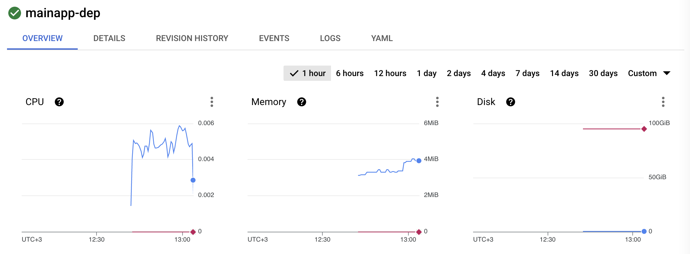
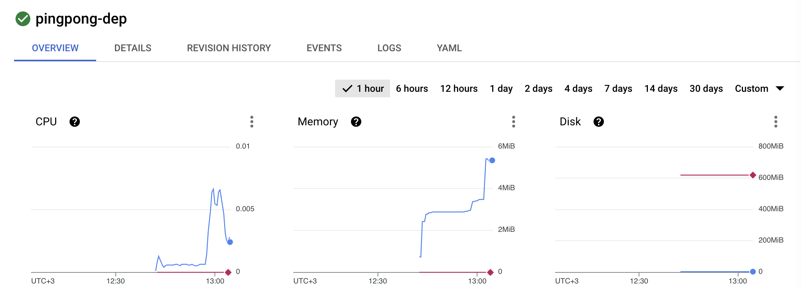
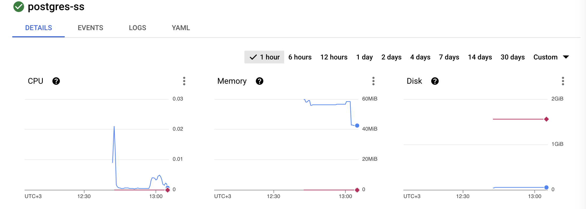

# Ex 3.09

## Checking out the correct version

To rebuild the same image, first checkout the correct tag:

```
git checkout ex3.09
```

## Building the applications

### Create cluster, other needed GCP resources and sync kubectl creds

```
make gcp-infra-preq gcp-infra-up gcp-sync-kubectl-creds
```

### Init secrets

Init (or update) the secret when setting up for the first time:

Create template for Secret (without saving it to version control) to
project/backend/manifests/secrets:

```yml
# project/backend/manifests/secrets/postgres-pwd.yaml
apiVersion: v1
kind: Secret
metadata:
  name: postgres-password
  namespace: hy-kube-project
data:
  PASSWORD: QW5vdGhlclZlcnlCaWdBbmRJbXBvcnRhbnRTZWNyZXQ= # FIXME, remember to encode to base64
```

Generate a new key:
```bash
age-keygen -o project/backend/manifests/secrets/key.txt
```

Update public key in .sops.yaml:
```yml
# pingpong/manifests/secrets/.sops.yaml
creation_rules:
  - encrypted_regex: "^(data)$"
    age: "age1k0upvtn0gwftpep5kxq47xztxj7ulmfhk6t9ha82sd6r5jrjsegsdr0wua" # FIXME
```

Encrypt the key:
```
make encrypt-pingpong-secrets
```

Commit the updated versions of .sops.yaml and postgres-pwd.enc.yaml.

### Github Actions configuration

Github Action will build the project when pushed to 'master' or 'develop'.

The following Github secrets are needed:

* GCP_CREDENTIALS - GCP Credentials of the GCP GitHub service account
  * Can be shown in terminal with `make gcp-infra-preq gcp-infra-up gcp-show-github-sa-key`
* GKE_PROJECT - Name of the Google cloud project
* SOPS_PRIVATE_KEY - Private key used to encrypt the secrets, see the 'Init secrets'.
* DOCKER_PASSWORD - Dockerhub password, only needed for pingpong and mainapp
* DOCKER_USERNAME - Dockerhub username, only needed for pingpong and mainap

## Deployment

### Deploy manifests

```
make apply-pingpong-kube apply-mainapp-kube
```

## Testing

```
$ kubectl get ingress --namespace mainapp
NAME               CLASS    HOSTS   ADDRESS          PORTS   AGE
pingpong-ingress   <none>   *       34.117.104.209   80      13m
```

Generating load:
```
for i in {1..1000};
  do
    echo ''
    curl 34.117.104.209/pingpong
    echo ''
    curl 34.117.104.209/pingpong/pings
    echo ''
    curl 34.117.104.209
    sleep 0.1;
  done
```
mainapp-dep resouce usage:



set limits:
cpu: 20m
memory: 40Mi

pingpong-dep resouce usage:



set limits:
cpu: 50m
memory: 50Mi

postgres-ss resouce usage:



set limits:
cpu: 100m
memory: 250Mi